# 流程梳理

```mermaid
sequenceDiagram
    participant 用户
    participant 前端
    participant 后端
    participant 智能体
    participant 公积金平台

    Note over 用户, 公积金平台: 阶段一：发起办理 & 提取前校验
    用户->>前端: 输入提取意向
    前端->>后端: 提交用户内容
    后端->>智能体: 提交用户内容
    智能体->>智能体: 识别到办理意图
    智能体->>后端: 调用 开始办理API

    rect rgb(200, 230, 255)
        Note over 后端, 公积金平台: 提取前校验
        后端->>公积金平台: 调用 提取前校验API
        alt 校验通过
            公积金平台-->>后端: 校验通过
            后端->>公积金平台: 调用 近期提取列表API
            公积金平台-->>后端: 返回 近期提取列表
            后端-->>智能体: 返回 校验通过 & 近期提取列表
            智能体->>智能体: 总结信息，生成提取选项列表
            智能体-->>后端: 返回 提取选项列表
            后端-->>前端: 返回 提取选项列表
            前端-->>用户: 展示 提取选项列表 (如：租房提取)
        else 校验不通过
            公积金平台-->>后端: 返回 校验不通过
            后端-->>智能体: 返回 校验不通过
            智能体->>智能体: 总结信息
            智能体-->>后端: 返回 不通过原因总结
            后端-->>前端: 返回 不通过原因
            前端-->>用户: 展示 不通过原因
        end
    end

    Note over 用户, 公积金平台: 阶段二：用户选择租房提取
    用户->>前端: 点击"租房提取"
    前端->>后端: 提交"租房提取"选择
    后端->>智能体: 提交用户选择
    智能体->>智能体: 识别为租房提取意图
    智能体->>后端: 调用 租房提取API

    rect rgb(200, 255, 200)
        Note over 后端, 公积金平台: 租房提取流程 - 授权判断
        后端->>公积金平台: 调用 提取授权判断API
        alt 未授权
            公积金平台-->>后端: 返回 未授权
            后端-->>智能体: 返回 提示授权
            智能体-->>后端: 返回 提示授权
            后端-->>前端: 返回 提示授权 & 授权卡片
            前端-->>用户: 展示 提示 & 授权卡片
            用户->>前端: 点击授权卡片，跳转并完成授权
            前端->>后端: 通知 授权完成
            后端->>智能体: 发送 用户完成授权
            智能体->>后端: 再次调用 租房提取API
            后端->>公积金平台: 调用 婚姻状态API
        else 已授权
            公积金平台-->>后端: 返回 已授权
            后端->>公积金平台: 调用 婚姻状态API
        end
    end

    rect rgb(255, 255, 200)
        Note over 后端, 公积金平台: 租房提取流程 - 婚姻状态判断
        公积金平台-->>后端: 返回 婚姻状态
        alt 已婚
            后端->>公积金平台: 调用 配偶签约API
            公积金平台-->>后端: 返回 配偶签约状态
            alt 配偶未签约
                后端-->>智能体: 返回 提示完成配偶签约
                智能体-->>后端: 返回 提示完成配偶签约
                后端-->>前端: 返回 提示 & 配偶签约卡片
                前端-->>用户: 展示 提示 & 配偶签约卡片
                Note right of 用户: 配偶完成签约
                用户->>前端: 配偶完成签约后，点击继续
                前端->>后端: 通知 配偶签约完成
                后端->>智能体: 发送 配偶签约完成
                智能体->>后端: 再次调用 租房提取API
            else 配偶已签约
                Note right of 后端: 流程继续
            end
            
            opt 需配偶授权
                后端-->>智能体: 返回 需授权配偶信息
                智能体-->>后端: 返回 需授权配偶信息
                后端-->>前端: 返回 需配偶授权 & 授权卡片
                前端-->>用户: 展示 需配偶授权 & 授权卡片
                Note right of 用户: 配偶完成授权
                用户->>前端: 配偶完成授权后，点击继续
                前端->>后端: 通知 配偶授权完成
                后端->>智能体: 发送 配偶授权完成
                智能体->>后端: 再次调用 租房提取API
            end
        else 未婚
            Note right of 后端: 流程继续
        end
    end

    rect rgb(255, 220, 200)
        Note over 后端, 公积金平台: 租房提取流程 - 核心条件校验
        后端->>公积金平台: 调用 账户状态判断API
        公积金平台-->>后端: 返回 账户状态
        alt 账户异常 (冻结/注销)
            后端-->>智能体: 返回 无法提取原因
            智能体-->>后端: 返回 无法提取原因
            后端-->>前端: 返回 无法提取原因
            前端-->>用户: 展示 无法提取原因
        else 账户正常
            后端->>公积金平台: 调用 手机签约判断API
            公积金平台-->>后端: 返回 手机签约状态
            alt 未签约
                后端-->>智能体: 返回 提醒未签约
                智能体-->>后端: 返回 提醒未签约
                后端-->>前端: 返回 提醒未签约 & 签约卡片
                前端-->>用户: 展示 提醒未签约 & 签约卡片
                Note right of 用户: 用户完成手机签约
                用户->>前端: 完成签约后，点击继续
                前端->>后端: 通知 手机签约完成
                后端->>智能体: 发送 手机签约完成
                智能体->>后端: 再次调用 租房提取API
            else 已签约
                Note right of 后端: 流程继续
            end

            后端->>公积金平台: 调用 银行卡签约判断API
            公积金平台-->>后端: 返回 银行卡签约状态
            alt 未签约
                后端-->>智能体: 返回 提醒银行卡未签约
                智能体-->>后端: 返回 提醒银行卡未签约
                后端-->>前端: 返回 提醒未签约 & 银行卡签约卡片
                前端-->>用户: 展示 提醒未签约 & 银行卡签约卡片
                Note right of 用户: 用户完成银行卡签约
                用户->>前端: 完成签约后，点击继续
                前端->>后端: 通知 银行卡签约完成
                后端->>智能体: 发送 银行卡签约完成
                智能体->>后端: 再次调用 租房提取API
            else 已签约
                后端->>公积金平台: 调用 多孩家庭判断API
                公积金平台-->>后端: 返回 是否多孩
                alt 是多孩家庭
                    后端-->>智能体: 返回 需线下办理
                    智能体-->>后端: 返回 需线下办理
                    后端-->>前端: 返回 需线下办理
                    前端-->>用户: 展示 需线下办理
                else 非多孩家庭
                    后端->>公积金平台: 调用 缴存、提取判断API
                    公积金平台-->>后端: 返回 判断结果
                    alt 近期提取过 或 未连续缴纳
                        后端-->>智能体: 返回 无法提取原因
                        智能体-->>后端: 返回 无法提取原因
                        后端-->>前端: 返回 无法提取原因
                        前端-->>用户: 展示 无法提取原因
                    else 符合条件
                        后端->>公积金平台: 调用 房产判断API
                        公积金平台-->>后端: 返回 房产信息
                        alt 在缴存地有房产
                            后端-->>智能体: 返回 无法提取
                            智能体-->>后端: 返回 无法提取
                            后端-->>前端: 返回 无法提取
                            前端-->>用户: 展示 无法提取
                        else 无房产
                            后端->>公积金平台: 调用 家庭贷款判断API
                            公积金平台-->>后端: 返回 贷款信息
                            alt 有未结清贷款
                                后端-->>智能体: 返回 无法提取原因
                                智能体-->>后端: 返回 无法提取原因
                                后端-->>前端: 返回 无法提取原因
                                前端-->>用户: 展示 无法提取原因
                            else 无未结清贷款
                                Note over 后端, 公积金平台: 全部条件满足！
                                后端-->>智能体: 返回 满足条件
                                智能体-->>后端: 返回 满足条件
                                后端-->>前端: 返回 满足条件 & 提取卡片
                                前端-->>用户: 展示 提取卡片 (可输入金额)
                                用户->>前端: 输入金额并提交
                                前端->>后端: 提交提取申请
                                Note over 后端, 公积金平台: 后端处理提取申请
                                后端-->>前端: 返回 提交成功 & 展示提取记录按钮
                                前端-->>用户: 展示 提交成功 & 提取记录按钮
                                用户->>前端: 点击提取记录按钮
                                前端-->>用户: 跳转至提取历史页面
                            end
                        end
                    end
                end
            end
        end
    end
```

## 流程阶段字典

| **编号** | **阶段** | **描述** | **请求返回话术** |
| --- | --- | --- | --- |
| 10000 | 未开始 |  |  |
| 10001 | 开始办理 |  |  |
| 20000 | 未提取前校验 |  |  |
| 20001 | 提取前校验不通过 |  |  |
| 20002 | 提取前校验通过 |  |  |
| 30000 | 未授权 |  | {"card\_type": "withdrawl\_auth", "card\_message": "请点击授权卡片完成授权"} |
| 30001 | 完成授权 |  |  |
| 30002 | 已授权 |  |  |
| 40000 | 未检验婚姻 |  |  |
| 40001 | 未婚 |  |  |
| 40002 | 已婚 |  |  |
| 50000 | 配偶未手机签约 |  |  |
| 50001 | 配偶完成签约 |  |  |
| 50002 | 配偶已手机签约 |  |  |
| 60000 | 配偶未完成信息授权 |  |  |
| 60001 | 配偶已完成信息授权 |  |  |
| 70000 | 账户状态异常 |  |  |
| 70001 | 账户状态正常 |  |  |
| 80000 | 本人未手机签约 |  | {"card\_type": "sign", "card\_message": "请点击手机号签约卡片完成签约"} |
| 80001 | 本人完成手机签约 |  |  |
| 80002 | 本人已手机签约 |  |  |
| 90000 | 本人未银行卡签约 |  | {"card\_type": "sign", "card\_message": "请点击银行卡签约卡片完成签约"} |
| 90001 | 本人完成银行卡签约 |  |  |
| 90002 | 本人已银行卡签约 |  |  |
| 11000 | 多孩家庭 |  |  |
| 11001 | 非多孩家庭 |  |  |
| 12000 | 提取/缴纳 不通过 |  |  |
| 12001 | 提取/缴纳 通过 |  |  |
| 13000 | 缴存地无房产 |  |  |
| 13001 | 缴存地有房产 |  |  |
| 14000 | 无未结清贷款 |  |  |
| 14001 | 有未结清贷款 |  |  |
| 15000 | 满足租房提取条件 |  | {"card\_type": "finish", "card\_message": "满足提取条件"} |

